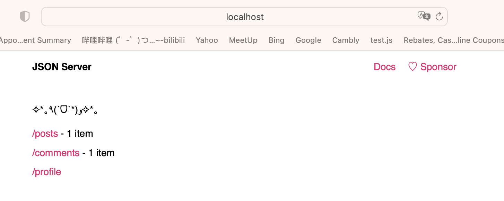
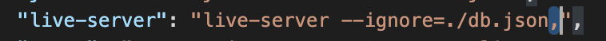

It's a little practive project, use JsonServer as back end to mock To Do List.
This is my study note...
- json-server
- fetch API
- MVC Model
____
### JsonServer

JSON Server is a Node.js application for creating virtual RESTful APIs. It allows you to use JSON files as data sources to simulate real backend server behavior through HTTP requests.

1. how to install json-server
```
cd todolist
npm init : Used to initialize a new package.json in the current directory
<-y> : Indicates that the default settings are used during initialization without user interaction confirmation.
```
```
npm install json-server
<-g> global install
<--save> Add installed packages to dependencies in package.json file
```

2. how to start json server
```
json-server --watch db.json
```

3. create a script to simpify start: write in `package.json`
```
scripts": {
    "test": "echo \"Error: no test specified\" && exit 1",
    "json-server": "json-server --watch db.json"
},
```
and the run json-server
```
npm run json-server
```


### Llive-server
HTTP server tool, which is used to quickly start a static file server locally and supports real-time refresh function.
1. live-server can quickly start a local server with a simple command, eliminating the trouble of manual configuration.
2. live-server can automatically monitor file changes and automatically refresh the browser when files change, realizing real-time preview and refresh functions, making the development process more efficient and smooth
```
npm i live-server
```

____
### XMLHttpRequest & fetch & axios
XMLHttpRequest, fetch, and axios are all tools used to make HTTP requests in the browser
1. XMLHttpRequest
- It is part of the web standards, first introduced in IE5 and now supported by all modern browsers.
- 
```javascript
var xhr = new XMLHttpRequest();
xhr.open('GET', 'https://api.example.com/data', true);
xhr.onload = function() {
    if (xhr.status >= 200 && xhr.status < 300) {
        var responseData = JSON.parse(xhr.responseText);
        console.log(responseData);
    } else {
        console.error('request fail:' + xhr.status);
    }
};
xhr.onerror = function() {
    console.error('error happen');
};
xhr.send();
```
2. fetch
- fetch is an API provided natively by the browser. It returns a Promise object. It is relatively simple to use, but it requires manual processing and conversion of response data.
- The fetch API does not have a built-in req/resp interceptor function and requires manual writing and management of interception logic
- The fetch API will not automatically throw an error when a network request error occurs. You need to manually check the response status code to determine whether the request is successful and handle the error accordingly.
```javascript
fetch('https://api.example.com/data')
  .then(response => {
    if (!response.ok) {
      throw new Error('request fail');
    }
    return response.json();
  })
  .then(data => {
    console.log(data);
  })
  .catch(error => {
    console.error('happen error:', error);
  });
```

> callback hell
When using fetch to send multiple consecutive asynchronous requests, if the Promise chain is not handled appropriately, a situation similar to callback hell may occur.
```javascript
fetch('https://api.example.com/endpoint1')
  .then(response1 => {
    return response1.json();
  })
  .then(data1 => {
    fetch('https://api.example.com/endpoint2')
      .then(response2 => {
        return response2.json();
      })
      .then(data2 => {
        fetch('https://api.example.com/endpoint3')
          .then(response3 => {
            return response3.json();
          })
          .then(data3 => {
            // ...
          })
          .catch(error3 => {
            console.error('request1 error:', error3);
          });
      })
      .catch(error2 => {
        console.error('request2 error', error2);
      });
  })
  .catch(error1 => {
    console.error('request3 error', error1);
  });
```
3. async / await 
- `async/await` is a syntactic sugar for handling asynchronous operations in JavaScript
- The `async` keyword is used to define an asynchronous function that implicitly returns a Promise object. 
- Inside an asynchronous function, you can use the `await` keyword to pause the execution of the asynchronous function, wait for the Promise object to be resolved or rejected, and return the resolved value.
```javascript
async function fetchData() {
  try {
    const response1 = await fetch('https://api.example.com/endpoint1');
    const data1 = await response1.json();

    const response2 = await fetch('https://api.example.com/endpoint2');
    const data2 = await response2.json();

    const response3 = await fetch('https://api.example.com/endpoint3');
    const data3 = await response3.json();

    // ...
  } catch (error) {
    console.error('发生错误：', error);
  }
}

fetchData();
```
4. axios
- Axios is a popular JavaScript library
- Axios supports the ability to cancel requests, which is useful when a request needs to be aborted when a component is unloaded or when the user cancels the operation.
```javascript
const axios = require('axios');
const CancelToken = axios.CancelToken;
const source = CancelToken.source();
// a function to cancle request
const cancelRequest = () => {
  source.cancel('request be cancled');
};
axios.get('https://api.example.com/data', {
  cancelToken: source.token 
})
.then(response => {
  console.log('success response', response.data);
})
.catch(error => {
  if (axios.isCancel(error)) {
    console.log('request be cancled', error.message);
  } else {
    console.error('happen error', error);
  }
});
```
| item | XMLHttpRequest      | fetch       | async / await     |axios |
|------------|-------------|-----------|-----------|---------|
| compatible    | ✅     | ✅   | introduced in ES8| need dependency|
| callback hell   | ✅     | ✅   | ❎ | ❎ |
| cancel request | xhr.abort() | AbortController() | AbortController()|cancelToken.source()|
| catching exception | .catch()|.catch()|try{}catch()|.catch()|

___
**<font color="red">❗️Notice</font>**
1. When writing the command for 'live-server' in the scripts, it is necessary to add a comma after the '--ignore' command; otherwise, 'change detected' will occur multiple times

____
DOM > Document > API 
> 1. document.querySelector() method
returns the `first` Element within the document that matches the specified selector
> 2. document.querySelectorAll()
returns a static (not live) NodeList representing a list of the document's elements that match the specified group of selectors.
> 3. document.getElementById()
> 4. createElement()
> 5. appendChild(node)
> 6. removeChild(node)
> 7. setAttribute(name, value)
> 8. getAttribute(name)
> 9. addEventListener(event, handler)

DOM > Element > properties
> 1. ele.innerHTML
    - If unvalidated user input is inserted directly into innerHTML, a malicious user could inject malicious JavaScript code, leading to a security vulnerability in the website
    - it is best to use safer DOM manipulation methods to manipulate an element's content, such as : textContent, createElement and appendChild etc.
____
### Reference
https://github.com/shahedbd/jsonServer
https://www.npmjs.com/package/live-server
https://developer.mozilla.org/zh-CN/docs/Web/API/XMLHttpRequest
https://developer.mozilla.org/en-US/docs/Web/API/Fetch_API/Using_Fetch